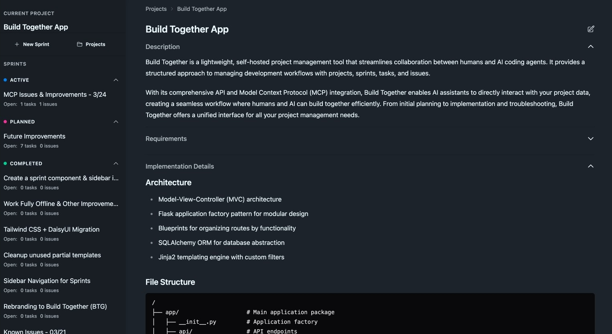
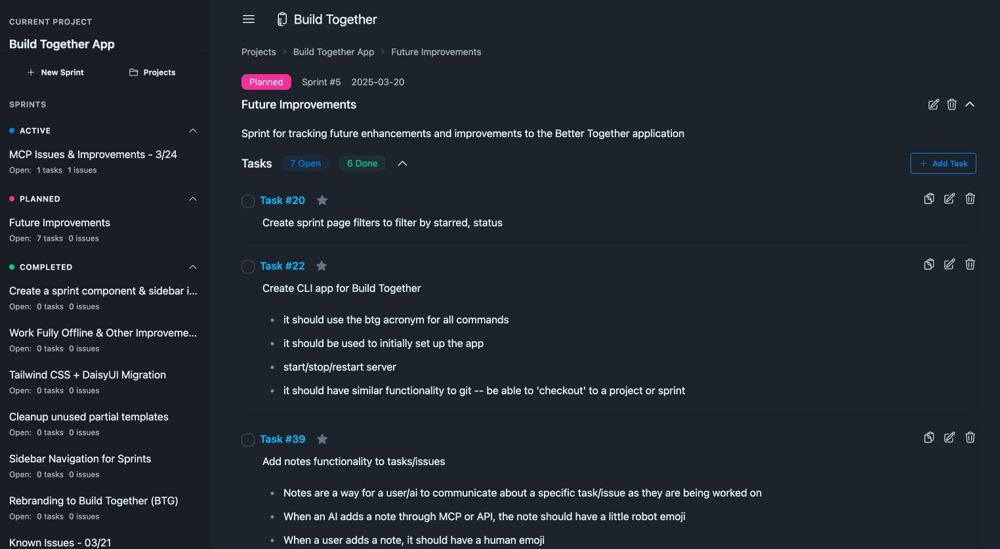
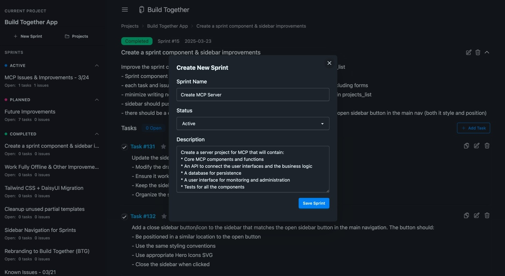
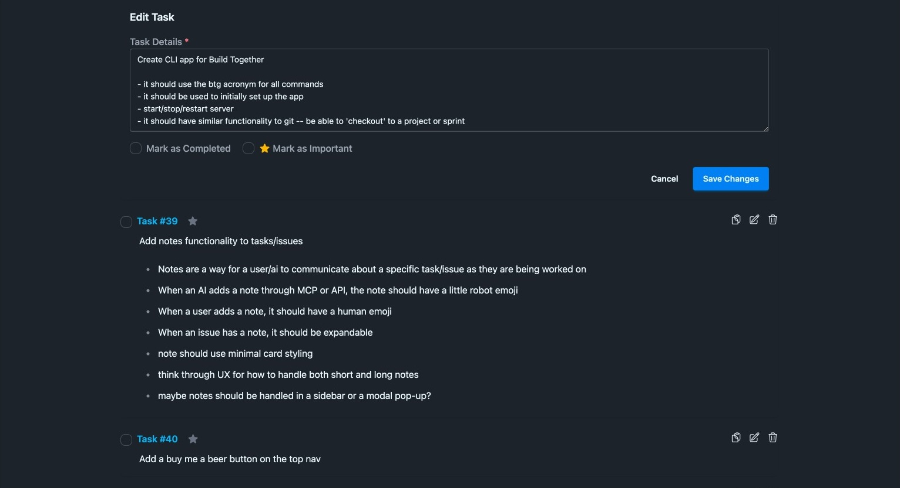
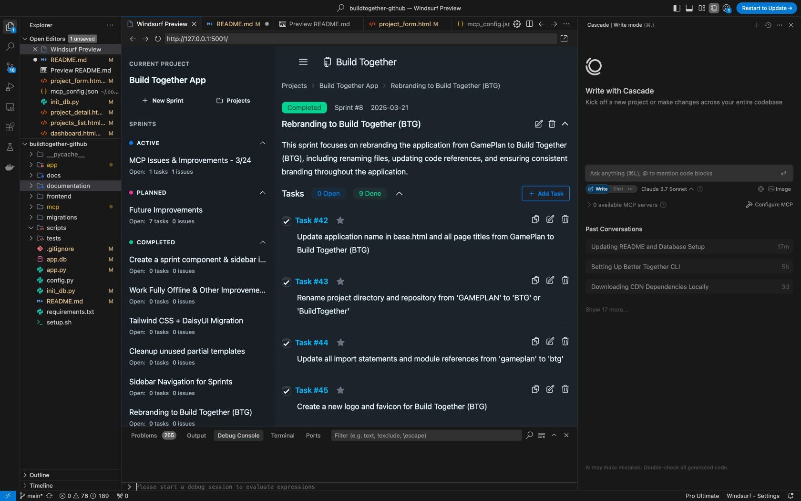

# Build Together

Build Together is a project management tool for vibe coders. It's lightweight, self-hosted and built from the groundup for intuitive AI+Human collaboration. It features a dynamic web interface, a REST API, and full Model Context Protocol (MCP) support for use with AI coding assistants like Cursor, Claude Code, and Windsurf.

## Features

- Create and manage projects with requirements and implementation details
- Organize work into sprints with different statuses (Planned, Active, Completed)
- Track tasks and issues with completion status
- Star important tasks and issues for quick identification (tell the AI assistant to work on all starred tasks)
- RESTful API for all operations
- MCP server for AI assistant integration
- Responsive and dynamic UI with Tailwind & DaisyUI styling
- HTMX for dynamic content updates without page reloads
- Markdown support for rich text formatting in all detail fields


## Setup

### Quick Setup (Recommended)

The easiest way to get started is to use the provided setup script:

```bash
# Clone the repository
git clone https://github.com/markoinla/build-together.git
cd build-together

# Make the setup script executable
chmod +x setup.sh

# Run the setup script
./setup.sh
```

This script will:
1. Check for Python 3.9+
2. Create a virtual environment
3. Install all required dependencies
4. Initialize the database with sample data
5. Configure the MCP server
6. Create a run script for easy application startup

### Running the Application

After setup is complete, you can run the application using:

```bash
# Start the main application
./run.sh
```

The application will be available at http://127.0.0.1:3149 by default.

### Setting Up with AI Assistants

#### For Cursor

1. Open the Build Together project in Cursor
2. In Cursor, use the command palette (Cmd+Shift+P) and search for "Connect to MCP Server"
3. When prompted for the MCP script path, point to `./mcp/run_mcp.sh`
4. Cursor will automatically start and manage the MCP server for you
5. You can now use natural language to manage your projects through Cursor

#### For Windsurf

1. Open the Build Together project in Windsurf
2. Add the following configuration to your Windsurf MCP config file (located at `~/.codeium/windsurf/mcp_config.json`):
   ```json
   "buildtogether": {
     "command": "/path/to/your/project/mcp/run_mcp.sh",
     "args": [],
     "env": {
       "PYTHONUNBUFFERED": "1",
       "PYTHONIOENCODING": "utf-8",
       "BTG_BASE_URL": "http://127.0.0.1:3149"
     }
   }
   ```
   Make sure to replace `/path/to/your/project` with the actual path to your Build Together project.
3. Restart Windsurf to apply the configuration
4. You can now use natural language to manage your projects through Windsurf

## Screenshots



*Project Details View: Manage project information, sprints, tasks, and issues in one place.*



*Sprint Details View: Track tasks and issues within each sprint with clear status indicators.*



*Create Sprint View: Easily create new sprints with title, status, and description.*



*Edit Task View: Update task details, status, and other properties.*



*Windsurf Integration: Use natural language to manage your projects through AI assistance.*

### Manual Setup

If you prefer to set up manually:

1. Clone the repository:
```bash
git clone https://github.com/markoinla/build-together.git
cd build-together
```

2. Create and activate a virtual environment:
```bash
python3 -m venv venv
source venv/bin/activate  # On Windows: venv\Scripts\activate
```

3. Install dependencies:
```bash
pip install -r requirements.txt
```

4. Initialize the database:
```bash
python3 init_db.py
```

5. Run the application:
```bash
flask run --port 3149
```

6. In a separate terminal, run the MCP server:
```bash
./mcp/run_mcp.sh
```

The application will be available at http://127.0.0.1:3149 by default.

## Configuration

Build Together can be configured through the `config.py` file or environment variables:

- `SECRET_KEY`: Used for session security (default: dev-secret-key in development)
- `PORT`: The port on which the application runs (default: 3149)
- `DATABASE_URL`: Database connection string (default: SQLite file in project root)

You can override these settings by:
1. Setting environment variables with the same names
2. Creating a `.env` file in the project root with these variables
3. Directly editing the `config.py` file (not recommended for production)

## Project Structure

```
build-together/
├── app/                    # Application package
│   ├── api/                # API endpoints
│   ├── models/             # Database models
│   ├── routes/             # Route handlers
│   ├── static/             # Static files (CSS, JS)
│   ├── templates/          # Jinja2 templates
│   └── utils/              # Utility functions
├── frontend/               # Frontend tooling
│   ├── package.json        # NPM configuration
│   ├── tailwind.config.js  # Tailwind CSS configuration
│   └── postcss.config.js   # PostCSS configuration
├── mcp/                    # MCP server implementation
│   ├── tools/              # MCP tool definitions
│   └── run_mcp.sh          # MCP server startup script
├── migrations/             # Database migrations
├── tests/                  # Test suite
├── app.py                  # Application entry point
├── config.py               # Configuration settings
├── init_db.py              # Database initialization
├── run.sh                  # Application startup script
├── setup.sh                # Setup script
└── requirements.txt        # Project dependencies
```

## User Interface

Build Together uses a combination of technologies to create a smooth user experience:

- **Tailwind & DaisyUI**: For responsive styling and components
- **HTMX**: For dynamic content updates without full page reloads
- **Font Awesome & Bootstrap Icons**: For UI elements and icons
- **Markdown**: For rich text formatting in descriptions

### Star Feature

The star feature allows you to mark tasks and issues as important:

- Click the star icon next to a task or issue number to toggle its starred status
- Starred items are visually highlighted for quick identification
- The starred status is preserved when editing tasks or issues
- You can filter and sort by starred status (coming soon)

## API Documentation

The application provides a RESTful API for all CRUD operations:

- Projects: `/api/projects`
- Sprints: `/api/sprints`
- Tasks: `/api/tasks`
- Issues: `/api/issues`

Each endpoint supports:
- GET (list all or get by ID)
- POST (create)
- PUT (update)
- DELETE (delete)

### API Examples

#### List all projects
```bash
curl -X GET http://127.0.0.1:3149/mcp/execute -H "Content-Type: application/json" -d '{"name": "list_projects", "parameters": {}}' | python -m json.tool
```

#### Create a new project
```bash
curl -X POST http://127.0.0.1:3149/mcp/execute -H "Content-Type: application/json" -d '{"name": "create_project", "parameters": {"name": "New Project", "description": "Project description"}}' | python -m json.tool
```

#### Update a project
```bash
curl -X POST http://127.0.0.1:3149/mcp/execute -H "Content-Type: application/json" -d '{"name": "update_project", "parameters": {"project_id": 1, "name": "Updated Project", "description": "Updated description", "requirements": "Project requirements", "implementation_details": "Implementation details"}}' | python -m json.tool
```

#### Create a new sprint
```bash
curl -X POST http://127.0.0.1:3149/mcp/execute -H "Content-Type: application/json" -d '{"name": "create_sprint", "parameters": {"name": "Sprint 1", "description": "First sprint", "project_id": 1, "status": "Planned"}}' | python -m json.tool
```

#### Create a new task
```bash
curl -X POST http://127.0.0.1:3149/mcp/execute -H "Content-Type: application/json" -d '{"name": "create_task", "parameters": {"details": "Task details", "completed": false, "sprint_id": 1, "starred": false}}' | python -m json.tool
```

#### Update a task (mark as completed and starred)
```bash
curl -X POST http://127.0.0.1:3149/mcp/execute -H "Content-Type: application/json" -d '{"name": "update_task", "parameters": {"task_id": 1, "completed": true, "starred": true}}' | python -m json.tool
```

## MCP Integration

Build Together includes full MCP (Model Context Protocol) support for seamless integration with AI assistants. This allows AI coding assistants to interact with your projects, sprints, tasks, and issues programmatically.

### Setting Up MCP

1. Start the Build Together application:
```bash
./run.sh
```

2. In a separate terminal, start the MCP server:
```bash
./mcp/run_mcp.sh
```

3. Configure Windsurf to use the MCP server:
   - Open Windsurf settings
   - Navigate to the MCP configuration section
   - Add a new MCP server with the path to your `mcp/run_mcp.sh` script
   - The full path will be shown at the end of the setup script for easy copying

4. Add the following configuration to your Windsurf MCP config file (located at `~/.codeium/windsurf/mcp_config.json`):

```json
{
  "mcpServers": {
    "buildtogether": {
      "command": "/path/to/your/buildtogether-github/mcp/run_mcp.sh",
      "args": [],
      "env": {
        "PYTHONUNBUFFERED": "1",
        "PYTHONIOENCODING": "utf-8",
        "BTG_BASE_URL": "http://127.0.0.1:3149"
      }
    }
  }
}
```

> **Note**: Replace `/path/to/your/buildtogether-github` with the actual path to your Build Together installation. The port in `BTG_BASE_URL` should match the port configured in your `config.py` file.

> **Note**: When using Build Together with AI coding assistants, the tool names might be prefixed (e.g., with `mcp1_`). This is handled automatically by these tools, so you can refer to them without the prefix in your prompts.

### Available MCP Tools

Build Together provides the following MCP tools for AI assistants:

**Project Management:**
- `list_projects` - List all projects with their details
- `create_project` - Create a new project with name, description, and optional requirements
- `get_project` - Get detailed information about a specific project by ID
- `update_project` - Update an existing project's details

**Sprint Management:**
- `list_sprints` - List all sprints for a project with their statuses
- `create_sprint` - Create a new sprint within a project
- `get_sprint` - Get detailed information about a specific sprint
- `update_sprint` - Update a sprint's name, description, or status

**Task Management:**
- `list_tasks` - List all tasks for a sprint, optionally filtered by status
- `create_task` - Create a new task within a sprint
- `get_task` - Get detailed information about a specific task
- `update_task` - Update a task's details, completion status, or starred status

**Issue Management:**
- `list_issues` - List all issues for a sprint, optionally filtered by status
- `create_issue` - Create a new issue within a sprint
- `get_issue` - Get detailed information about a specific issue
- `update_issue` - Update an issue's details, resolution status, or starred status

### Using MCP Tools in Windsurf

You can use these tools directly in your conversations with Windsurf. For example:

1. To create a new task: "Please create a task in the current sprint to implement the login feature"
2. To check project status: "What tasks are still incomplete in the current sprint?"
3. To update a task: "Mark the authentication task as completed"

Windsurf will automatically use the appropriate MCP tools to perform these actions.

## Development

### Running in Debug Mode

The application runs in debug mode by default when started with `./run.sh`. This means:

- The Flask server automatically detects and applies changes to Python files, templates, and static files
- No manual server restart is required after code changes
- For CSS changes, a hard refresh in the browser (Cmd+Shift+R on Mac or Ctrl+Shift+R on Windows) might be needed

### Frontend Development

If you need to modify the Tailwind CSS configuration:

1. Navigate to the frontend directory:
```bash
cd frontend
```

2. Install the frontend dependencies (if not already done):
```bash
npm install
```

3. Run the Tailwind CSS build process:
```bash
npm run build:css
```

### Database Migrations

Build Together uses Flask-Migrate for database schema evolution:

1. Initialize migrations (first time only):
```bash
flask db init
```

2. Create a migration after model changes:
```bash
flask db migrate -m "Description of changes"
```

## User Experience Notes

- All HTMX form submissions use the `hx-preserve` attribute to maintain the user's scroll position
- The application uses Tailwind CSS and DaisyUI components for a clean, modern UI
- Task and issue forms include a "Mark as important" option to set the starred status

## Known Issues

- AI assistants sometimes have trouble executing MCP commands or the MCP server requires multiple tool calls
- Copy task/issue ID doesn't work within Windsurf Browser Preview
- Various UX/UI improvements are needed

## License

MIT License

Copyright (c) 2025 Build Together

Permission is hereby granted, free of charge, to any person obtaining a copy
of this software and associated documentation files (the "Software"), to deal
in the Software without restriction, including without limitation the rights
to use, copy, modify, merge, publish, distribute, sublicense, and/or sell
copies of the Software, and to permit persons to whom the Software is
furnished to do so, subject to the following conditions:

The above copyright notice and this permission notice shall be included in all
copies or substantial portions of the Software.

THE SOFTWARE IS PROVIDED "AS IS", WITHOUT WARRANTY OF ANY KIND, EXPRESS OR
IMPLIED, INCLUDING BUT NOT LIMITED TO THE WARRANTIES OF MERCHANTABILITY,
FITNESS FOR A PARTICULAR PURPOSE AND NONINFRINGEMENT. IN NO EVENT SHALL THE
AUTHORS OR COPYRIGHT HOLDERS BE LIABLE FOR ANY CLAIM, DAMAGES OR OTHER
LIABILITY, WHETHER IN AN ACTION OF CONTRACT, TORT OR OTHERWISE, ARISING FROM,
OUT OF OR IN CONNECTION WITH THE SOFTWARE OR THE USE OR OTHER DEALINGS IN THE
SOFTWARE.